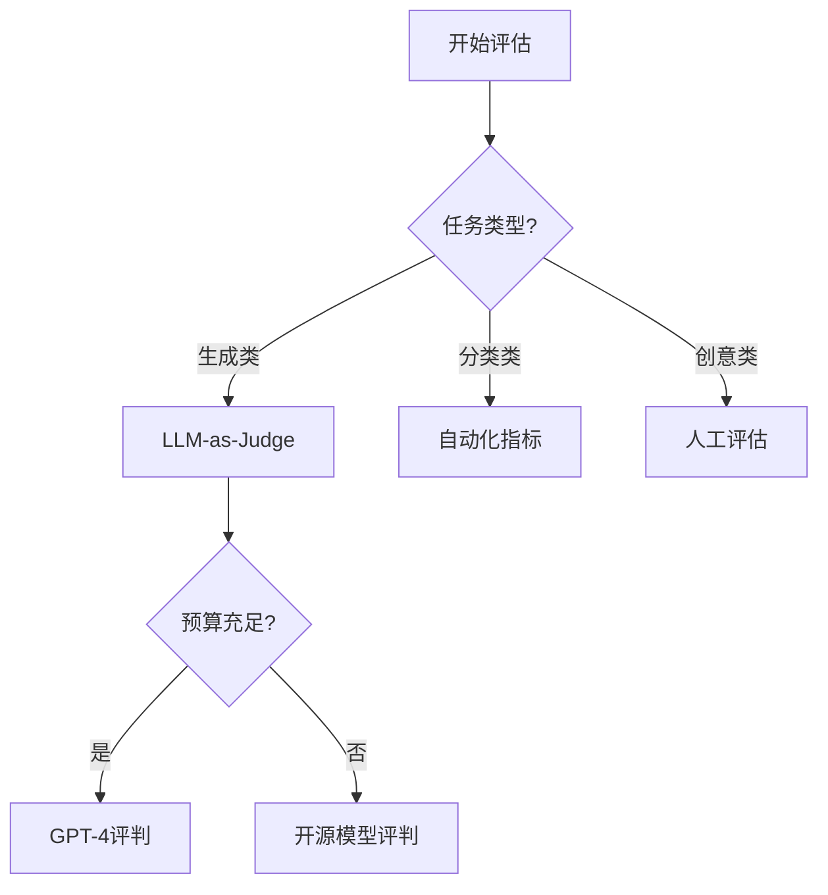

# 大模型评估实战指南 - 优化版大纲

## 📚 文档结构 (基于 Fumadocs)

```
content/docs/
├── index.mdx                      # 文档首页
├── meta.json                      # 导航配置
│
├── quick-start/                   # 🚀 快速开始（新手友好）
│   ├── why-evaluation.mdx         # 为什么要做评估
│   ├── first-evaluation.mdx       # 10分钟完成第一个评估
│   ├── understanding-results.mdx  # 理解评估结果
│   └── common-pitfalls.mdx        # 常见误区与解决方案
│
├── core-concepts/                 # 💡 核心概念
│   ├── evaluation-basics.mdx      # 评估基础知识
│   ├── metrics-explained.mdx      # 指标详解
│   ├── scoring-systems.mdx        # 评分体系设计
│   └── terminology.mdx            # 术语表
│
├── evaluation-strategies/         # 🎯 评估策略
│   ├── choosing-methods.mdx       # 如何选择评估方法
│   ├── llm-as-judge/              
│   │   ├── overview.mdx           # LLM评判概述
│   │   ├── prompt-engineering.mdx # 评判Prompt工程
│   │   └── implementation.mdx     # 实现示例
│   ├── human-evaluation/          
│   │   ├── setup.mdx              # 人工评估设置
│   │   ├── quality-control.mdx    # 质量控制
│   │   └── scaling.mdx            # 规模化方案
│   ├── automated-testing.mdx      # 自动化测试
│   └── hybrid-approaches.mdx      # 混合评估方案
│
├── practical-metrics/             # 📊 实用指标
│   ├── task-specific/             # 任务特定指标
│   │   ├── chat-metrics.mdx       # 对话类指标
│   │   ├── rag-metrics.mdx        # RAG系统指标
│   │   ├── code-gen-metrics.mdx   # 代码生成指标
│   │   └── creative-metrics.mdx   # 创意生成指标
│   ├── universal-metrics.mdx      # 通用指标
│   ├── custom-metrics.mdx         # 自定义指标
│   └── metric-selection.mdx       # 指标选择指南
│
├── implementation-guide/          # 🔧 实施指南
│   ├── setup/                     # 环境搭建
│   │   ├── langfuse-setup.mdx     # Langfuse配置
│   │   ├── local-setup.mdx        # 本地环境
│   │   └── cloud-setup.mdx        # 云端部署
│   ├── integration/               # 集成方案
│   │   ├── python-integration.mdx # Python集成
│   │   ├── nodejs-integration.mdx # Node.js集成
│   │   └── api-integration.mdx    # API集成
│   ├── workflows/                 # 工作流程
│   │   ├── dev-workflow.mdx       # 开发工作流
│   │   ├── staging-workflow.mdx   # 测试环境流程
│   │   └── prod-workflow.mdx      # 生产环境流程
│   └── monitoring.mdx             # 监控与告警
│
├── datasets/                      # 📦 数据集管理
│   ├── dataset-design.mdx         # 数据集设计原则
│   ├── creating-datasets.mdx      # 创建测试数据集
│   ├── dataset-versioning.mdx     # 版本管理
│   ├── synthetic-data.mdx         # 合成数据生成
│   └── benchmark-datasets.mdx     # 基准数据集
│
├── real-world-examples/           # 💼 真实案例
│   ├── customer-service-bot/      # 客服机器人
│   │   ├── requirements.mdx       # 需求分析
│   │   ├── evaluation-plan.mdx    # 评估计划
│   │   ├── implementation.mdx     # 实施过程
│   │   └── results.mdx            # 结果分析
│   ├── content-generation/        # 内容生成
│   │   ├── blog-writer.mdx        # 博客写作评估
│   │   └── marketing-copy.mdx     # 营销文案评估
│   ├── code-assistant/            # 代码助手
│   │   ├── code-review.mdx        # 代码审查评估
│   │   └── bug-fixing.mdx         # Bug修复评估
│   └── knowledge-base-qa.mdx      # 知识库问答
│
├── advanced-topics/               # 🔬 高级主题
│   ├── bias-detection.mdx         # 偏见检测
│   ├── safety-evaluation.mdx      # 安全性评估
│   ├── hallucination-detection.mdx # 幻觉检测
│   ├── cost-optimization.mdx      # 成本优化
│   ├── multi-model-comparison.mdx # 多模型对比
│   └── continuous-learning.mdx    # 持续学习与改进
│
├── tools-ecosystem/               # 🛠️ 工具生态
│   ├── langfuse/                  # Langfuse深度使用
│   │   ├── features.mdx           # 功能详解
│   │   ├── best-practices.mdx     # 最佳实践
│   │   └── troubleshooting.mdx    # 问题排查
│   ├── alternative-tools.mdx      # 其他评估工具
│   ├── comparison.mdx             # 工具对比
│   └── integration-patterns.mdx   # 集成模式
│
├── automation/                    # ⚙️ 自动化
│   ├── ci-cd-integration.mdx      # CI/CD集成
│   ├── github-actions.mdx         # GitHub Actions配置
│   ├── scheduled-evaluation.mdx   # 定时评估
│   ├── alert-systems.mdx          # 告警系统
│   └── reporting.mdx              # 自动报告生成
│
├── cookbook/                      # 📖 实战手册
│   ├── recipes/                   # 常用配方
│   │   ├── accuracy-improvement.mdx # 提升准确率
│   │   ├── latency-reduction.mdx    # 降低延迟
│   │   ├── cost-reduction.mdx       # 降低成本
│   │   └── quality-assurance.mdx    # 质量保证
│   ├── troubleshooting/           # 故障排除
│   │   ├── common-issues.mdx      # 常见问题
│   │   ├── debugging-guide.mdx    # 调试指南
│   │   └── performance-issues.mdx # 性能问题
│   └── migration-guide.mdx        # 迁移指南
│
├── team-collaboration/            # 👥 团队协作
│   ├── roles-responsibilities.mdx # 角色与职责
│   ├── review-process.mdx         # 评审流程
│   ├── documentation.mdx          # 文档规范
│   └── knowledge-sharing.mdx      # 知识共享
│
└── reference/                     # 📚 参考资料
    ├── api-reference.mdx          # API参考
    ├── glossary.mdx               # 术语表
    ├── faq.mdx                    # 常见问题
    ├── resources.mdx              # 学习资源
    └── changelog.mdx              # 更新日志
```

## 📝 核心章节内容详解

### 🚀 快速开始 (Quick Start)

#### 为什么要做评估 (why-evaluation.mdx)
- **业务价值**：ROI量化、风险控制、用户体验提升
- **技术必要性**：模型选择、性能优化、问题发现
- **合规要求**：审计需求、质量标准、安全合规
- **真实案例**：未做评估导致的失败案例

#### 10分钟完成第一个评估 (first-evaluation.mdx)
```python
# 实战代码示例
1. 安装必要工具 (1分钟)
2. 配置环境 (2分钟)
3. 编写评估脚本 (3分钟)
4. 运行评估 (2分钟)
5. 查看结果 (2分钟)
```

### 🎯 评估策略 (Evaluation Strategies)

#### 选择评估方法决策树


### 📊 实用指标 (Practical Metrics)

#### 任务-指标匹配矩阵

| 任务类型 | 推荐指标 | 权重建议 | 评估频率 |
|---------|---------|---------|---------|
| 客服对话 | 解决率、满意度、响应时间 | 40%, 40%, 20% | 实时 |
| RAG系统 | 召回率、准确率、引用正确性 | 30%, 40%, 30% | 每次查询 |
| 代码生成 | 语法正确、功能完整、执行通过 | 20%, 40%, 40% | 每次生成 |
| 内容创作 | 原创性、相关性、可读性 | 30%, 40%, 30% | 批量评估 |

### 💼 真实案例 (Real-world Examples)

#### 案例结构模板
1. **背景介绍**
   - 业务场景
   - 技术栈
   - 团队规模
   
2. **挑战与目标**
   - 面临的问题
   - 评估目标
   - 成功标准
   
3. **解决方案**
   - 评估方法选择
   - 实施步骤
   - 代码示例
   
4. **结果与收获**
   - 量化结果
   - 经验教训
   - 可复用组件

### 🔬 高级主题 (Advanced Topics)

#### 幻觉检测专题
```python
# 多层次幻觉检测框架
1. 事实核查层
   - 知识库对比
   - 外部API验证
   
2. 一致性检查层
   - 上下文一致性
   - 逻辑一致性
   
3. 置信度评分层
   - 模型自评分
   - 不确定性量化
```

### ⚙️ 自动化 (Automation)

#### 完整的自动化评估流水线
```yaml
# .github/workflows/llm-evaluation.yml
name: LLM Evaluation Pipeline

on:
  push:
    paths: ['prompts/**', 'models/**']
  schedule:
    - cron: '0 2 * * *'  # 每日凌晨2点

jobs:
  evaluate:
    steps:
      - 数据集准备
      - 模型加载
      - 评估执行
      - 结果分析
      - 报告生成
      - 告警触发
```

## 🎯 文档特色与创新点

### 1. 渐进式学习路径
- **新手路径**：快速开始 → 核心概念 → 第一个案例
- **进阶路径**：评估策略 → 指标设计 → 自动化
- **专家路径**：高级主题 → 系统架构 → 规模化

### 2. 实战导向
- 每个概念配套可运行代码
- 真实企业案例分析
- 问题驱动的内容组织
- 成本效益分析

### 3. 工具无关性
- 核心概念独立于具体工具
- 多工具对比与选择指南
- 自建方案 vs 商业方案对比

### 4. 交互式学习
- 在线评估计算器
- 指标选择向导
- 评估方案生成器
- ROI计算工具

### 5. 社区驱动
- 用户贡献的评估模板
- 行业最佳实践分享
- 评估基准排行榜
- 月度案例分享

## 📅 内容优先级

### Phase 1 - 核心内容（第1-2周）
✅ 快速开始全部内容
✅ 核心概念基础
✅ LLM-as-Judge 实现
✅ 基础指标体系

### Phase 2 - 实践内容（第3-4周）
📝 完整案例（客服机器人）
📝 Langfuse 集成指南
📝 自动化基础配置
📝 数据集管理

### Phase 3 - 进阶内容（第5-6周）
📋 高级评估策略
📋 多模型对比
📋 成本优化
📋 团队协作流程

### Phase 4 - 生态完善（第7-8周）
🔄 工具生态对比
🔄 社区案例收集
🔄 交互式工具开发
🔄 视频教程制作

## 🔗 配套资源

### 代码仓库
- 评估模板库
- 示例数据集
- 自动化脚本
- Jupyter Notebooks

### 在线工具
- [评估方案生成器]
- [指标计算器]
- [ROI 分析工具]
- [Prompt 优化器]

### 社区资源
- Discord 讨论群
- 每周 Office Hour
- 月度最佳实践分享会
- 年度评估报告

## 💡 差异化优势

1. **实战优先**：不是理论堆砌，而是解决实际问题
2. **成本意识**：每个方案都包含成本分析
3. **快速见效**：强调快速验证和迭代
4. **工具中立**：不绑定特定工具，提供多种选择
5. **持续更新**：跟踪最新技术和最佳实践

## 🎓 学习成果

完成本教程后，你将能够：

- ✅ 在30分钟内搭建评估系统
- ✅ 选择适合业务的评估策略
- ✅ 设计科学的评估指标体系
- ✅ 实现自动化评估流水线
- ✅ 分析和优化模型性能
- ✅ 建立持续改进机制
- ✅ 量化LLM应用的业务价值