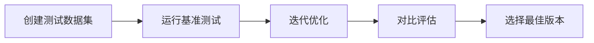
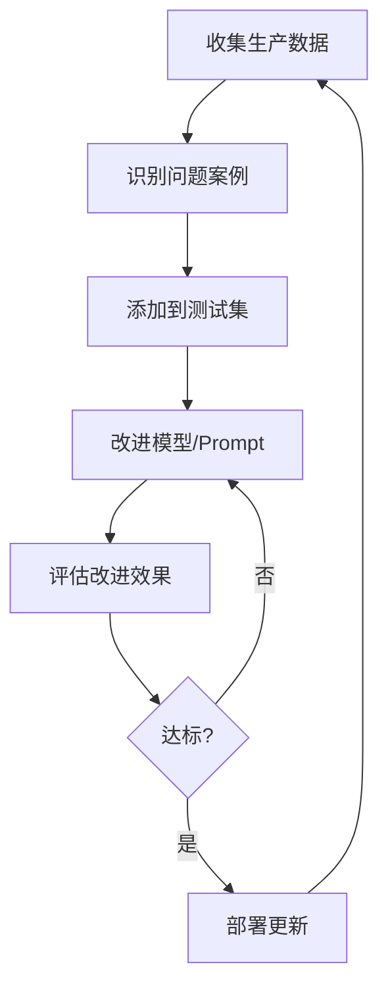

# 大模型评估指南

## 概述

大模型评估是确保 LLM 应用质量和性能的关键环节。本指南基于 Langfuse 的最佳实践，介绍如何系统地评估大模型的输出质量、监控生产环境健康度，以及在开发过程中测试变更。

## 评估方法

### 1. LLM-as-a-Judge (LLM 作为评判者)

使用另一个大模型来评估目标模型的输出质量。

**优势：**
- 自动化程度高，可大规模执行
- 评估标准一致性强
- 成本相对较低

**实施步骤：**
```python
# 使用评判 LLM 评估输出
def llm_judge_evaluation(output, criteria):
    judge_prompt = f"""
    请根据以下标准评估输出质量：
    标准：{criteria}
    输出：{output}
    
    评分（0-1）：
    """
    score = judge_llm.generate(judge_prompt)
    return score
```

**评估维度：**
- 准确性 (Accuracy)
- 相关性 (Relevance)
- 完整性 (Completeness)
- 语言流畅度 (Fluency)
- 安全性 (Safety)

### 2. 人工标注 (Manual Annotations)

通过人工审核建立评估基准。

**实施流程：**
1. 创建标注队列
2. 分配标注任务给评审员
3. 收集并汇总标注结果
4. 计算一致性指标（如 Cohen's Kappa）

**标注界面示例：**
```json
{
  "trace_id": "abc123",
  "output": "模型生成的响应",
  "annotation_fields": {
    "quality": ["优秀", "良好", "一般", "差"],
    "relevance": [1, 2, 3, 4, 5],
    "contains_errors": ["是", "否"]
  }
}
```

### 3. 用户反馈 (User Feedback)

收集终端用户的直接反馈。

**反馈收集方式：**
- 👍/👎 简单反馈
- 星级评分（1-5 星）
- 详细反馈表单

**实现示例：**
```python
# 收集用户反馈
langfuse.score(
    trace_id="user_session_123",
    name="user_satisfaction",
    value=4,  # 1-5 星评分
    comment="响应很有帮助，但速度较慢"
)
```

### 4. 自定义评分 (Custom Scoring)

根据业务需求定制评估指标。

**常见自定义指标：**
```python
# 响应时间评估
def evaluate_latency(trace):
    latency_ms = trace.end_time - trace.start_time
    if latency_ms < 1000:
        return 1.0  # 优秀
    elif latency_ms < 3000:
        return 0.7  # 良好
    else:
        return 0.3  # 需改进

# Token 使用效率
def evaluate_token_efficiency(trace):
    token_count = trace.usage.total_tokens
    output_quality = trace.scores.get("quality", 0)
    efficiency = output_quality / (token_count / 1000)
    return min(efficiency, 1.0)
```

## 评估指标体系

### 核心指标

| 指标类型 | 指标名称 | 计算方法 | 适用场景 |
|---------|---------|---------|---------|
| **质量指标** | 准确率 | 正确响应数 / 总响应数 | 事实性问答 |
| | BLEU 分数 | N-gram 重叠度 | 翻译任务 |
| | ROUGE 分数 | 召回率导向的评估 | 摘要任务 |
| **性能指标** | 响应延迟 | P50, P90, P99 延迟 | 实时应用 |
| | 吞吐量 | 请求数 / 秒 | 高并发场景 |
| | Token 效率 | 输出质量 / Token 消耗 | 成本优化 |
| **业务指标** | 用户满意度 | 平均评分 | 产品体验 |
| | 任务完成率 | 成功完成数 / 总任务数 | 任务型对话 |
| | 转化率 | 达成目标数 / 总会话数 | 商业应用 |

### 评分类型

```python
# 数值型评分 (Numeric)
langfuse.score(
    trace_id="123",
    name="accuracy",
    value=0.85,  # 0-1 范围
    data_type="NUMERIC"
)

# 布尔型评分 (Boolean)
langfuse.score(
    trace_id="123",
    name="contains_hallucination",
    value=False,
    data_type="BOOLEAN"
)

# 分类型评分 (Categorical)
langfuse.score(
    trace_id="123",
    name="sentiment",
    value="positive",  # positive/neutral/negative
    data_type="CATEGORICAL"
)
```

## 评估流程

### 1. 开发阶段评估



**实施步骤：**
1. **准备数据集**
   ```python
   test_dataset = [
       {"input": "问题1", "expected": "预期答案1"},
       {"input": "问题2", "expected": "预期答案2"},
       # ...
   ]
   ```

2. **运行评估**
   ```python
   for test_case in test_dataset:
       output = model.generate(test_case["input"])
       score = evaluate(output, test_case["expected"])
       langfuse.score(
           name="dev_evaluation",
           value=score
       )
   ```

3. **A/B 测试**
   ```python
   # 对比不同 prompt 或模型版本
   results_a = evaluate_version("v1")
   results_b = evaluate_version("v2")
   
   if results_b.mean_score > results_a.mean_score:
       deploy_version("v2")
   ```

### 2. 生产环境监控

**实时监控指标：**
```python
# 设置监控告警
monitoring_config = {
    "accuracy_threshold": 0.8,
    "latency_p99_ms": 3000,
    "error_rate": 0.01
}

# 实时评估
@monitor
def production_inference(input):
    start_time = time.time()
    try:
        output = model.generate(input)
        latency = time.time() - start_time
        
        # 异步评估质量
        async_evaluate(output)
        
        # 记录指标
        langfuse.score(
            name="production_latency",
            value=latency
        )
        
        return output
    except Exception as e:
        log_error(e)
        raise
```

### 3. 持续改进循环



## 评估数据管理

### 数据集组织

```python
# 创建评估数据集
dataset = langfuse.create_dataset(
    name="customer_service_qa",
    description="客服问答评估集",
    metadata={
        "version": "1.0",
        "domain": "customer_service",
        "size": 1000
    }
)

# 添加测试案例
dataset.create_item(
    input="如何退货？",
    expected_output="退货流程说明...",
    metadata={
        "category": "returns",
        "difficulty": "easy"
    }
)
```

### 版本管理

```python
# 跟踪不同版本的评估结果
evaluation_run = langfuse.create_run(
    name="eval_2024_01",
    dataset_id=dataset.id,
    model_version="gpt-4-turbo",
    prompt_version="v2.3"
)

# 记录评估结果
for item in dataset.items:
    output = model.generate(item.input)
    score = evaluate(output, item.expected_output)
    
    evaluation_run.add_observation(
        item_id=item.id,
        output=output,
        scores={"accuracy": score}
    )
```

## 评估仪表板

### 可视化配置

```python
# 配置评估仪表板
dashboard_config = {
    "metrics": [
        {
            "name": "accuracy",
            "type": "line_chart",
            "aggregation": "mean",
            "time_window": "1h"
        },
        {
            "name": "latency",
            "type": "histogram",
            "percentiles": [50, 90, 99]
        },
        {
            "name": "user_satisfaction",
            "type": "gauge",
            "threshold": 4.0
        }
    ],
    "filters": {
        "model_version": ["v1", "v2"],
        "environment": ["dev", "staging", "production"]
    }
}
```

### 报告生成

```python
def generate_evaluation_report(run_id):
    """生成评估报告"""
    run = langfuse.get_run(run_id)
    
    report = {
        "summary": {
            "total_cases": len(run.observations),
            "mean_accuracy": run.scores.accuracy.mean(),
            "median_latency": run.latency.median(),
            "success_rate": run.success_count / run.total_count
        },
        "detailed_metrics": {
            "by_category": analyze_by_category(run),
            "error_analysis": analyze_errors(run),
            "performance_breakdown": analyze_performance(run)
        },
        "recommendations": generate_recommendations(run)
    }
    
    return report
```

## 最佳实践

### 1. 建立评估基准

- **黄金数据集**：维护高质量的测试集，覆盖各种场景
- **人工基准**：定期进行人工评估，建立质量基准线
- **竞品对比**：与其他模型或解决方案进行对比评估

### 2. 多维度评估

```python
# 综合评分系统
def calculate_composite_score(trace):
    weights = {
        "accuracy": 0.4,
        "relevance": 0.3,
        "latency": 0.2,
        "cost_efficiency": 0.1
    }
    
    scores = {}
    scores["accuracy"] = evaluate_accuracy(trace)
    scores["relevance"] = evaluate_relevance(trace)
    scores["latency"] = evaluate_latency(trace)
    scores["cost_efficiency"] = evaluate_cost(trace)
    
    composite = sum(scores[k] * weights[k] for k in weights)
    
    return {
        "composite_score": composite,
        "breakdown": scores
    }
```

### 3. 自动化评估流程

```python
# CI/CD 集成
def automated_evaluation_pipeline():
    """自动化评估管道"""
    
    # 1. 拉取最新代码
    checkout_latest_code()
    
    # 2. 运行单元测试
    run_unit_tests()
    
    # 3. 运行评估套件
    results = run_evaluation_suite()
    
    # 4. 检查质量门槛
    if not meets_quality_threshold(results):
        raise QualityCheckFailed(results)
    
    # 5. 生成报告
    report = generate_report(results)
    
    # 6. 通知相关人员
    notify_stakeholders(report)
    
    return results
```

### 4. 异常检测

```python
# 检测异常行为
def detect_anomalies(trace):
    anomalies = []
    
    # 检测幻觉
    if contains_hallucination(trace.output):
        anomalies.append({
            "type": "hallucination",
            "severity": "high",
            "details": extract_hallucination_details(trace)
        })
    
    # 检测有害内容
    if contains_harmful_content(trace.output):
        anomalies.append({
            "type": "harmful_content",
            "severity": "critical",
            "details": extract_harmful_content(trace)
        })
    
    # 检测性能异常
    if trace.latency > LATENCY_THRESHOLD:
        anomalies.append({
            "type": "performance",
            "severity": "medium",
            "details": {"latency_ms": trace.latency}
        })
    
    return anomalies
```

## 工具集成

### Langfuse SDK 集成

```python
from langfuse import Langfuse

# 初始化客户端
langfuse = Langfuse(
    public_key="your_public_key",
    secret_key="your_secret_key",
    host="https://cloud.langfuse.com"
)

# 装饰器模式
@observe()
def generate_response(prompt):
    response = model.generate(prompt)
    
    # 自动记录追踪信息
    langfuse.score(
        name="quality",
        value=evaluate_quality(response)
    )
    
    return response
```

### API 集成

```python
import requests

# 通过 API 提交评分
def submit_score_via_api(trace_id, score_name, score_value):
    url = "https://api.langfuse.com/scores"
    headers = {
        "Authorization": f"Bearer {API_KEY}",
        "Content-Type": "application/json"
    }
    
    data = {
        "traceId": trace_id,
        "name": score_name,
        "value": score_value,
        "timestamp": datetime.now().isoformat()
    }
    
    response = requests.post(url, headers=headers, json=data)
    return response.json()
```

## 总结

大模型评估是一个持续迭代的过程，需要结合多种评估方法和指标来全面衡量模型性能。通过 Langfuse 等工具的支持，可以建立系统化的评估体系，实现：

1. **开发阶段**：快速迭代和优化
2. **测试阶段**：全面验证质量
3. **生产环境**：实时监控和告警
4. **持续改进**：基于数据驱动的优化

关键成功因素：
- ✅ 建立全面的评估指标体系
- ✅ 自动化评估流程
- ✅ 持续收集和分析反馈
- ✅ 快速响应和迭代改进
- ✅ 跨团队协作和知识共享

通过遵循本指南的最佳实践，可以确保大模型应用始终保持高质量和可靠性。